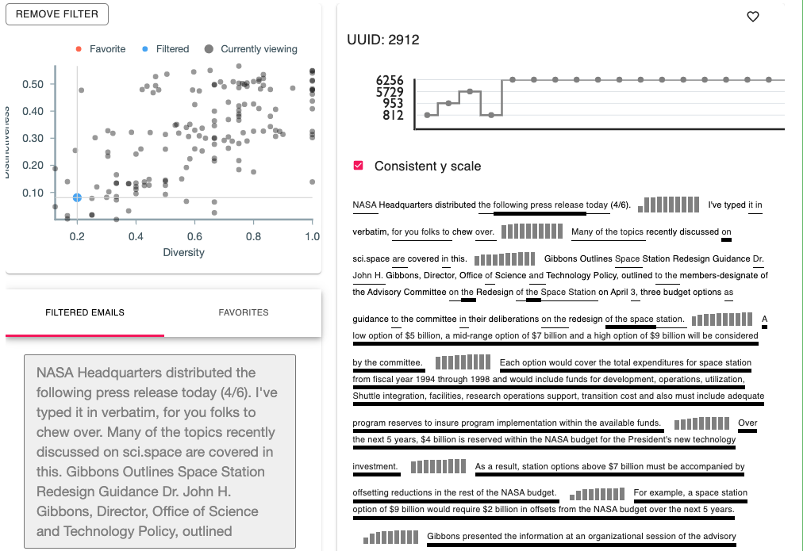

# About `GenX`
To appear in the [2nd Workshop on Data  Science with Human-in-the-loop: Language Advances (DaSH-LA)](https://sites.google.com/view/dash-la2021)


## Abstract
Current methods for evaluation of natural language generation models focus on measuring text quality but fail to probe the model creativity, i.e., its ability to generate novel but coherent text sequences not seen in the training corpus. We present the GenX tool which is designed to enable interactive exploration and explanation of natural language generation outputs with a focus on the detection of memorization. We demonstrate the tool on two domain-conditioned generation use cases---phishing emails and ACL abstracts. 

## Live Demo



# Getting `GenX`

## Installation
`pip install genx`

## Usage
See the [demo notebook](notebooks/Demo.ipynb)

# How to cite
```
@inproceedings{duskin2021genx,
  title={Evaluating and Explaining Natural Language Generation with GenX},
  author={Duskin, Kayla and Sharma, Shivam and Yun, Ji Young and Arendt, Dustin},
  booktitle={Proceedings of the Second Workshop on Data Science with Human in the Loop: Language Advances},
  year={2021}
}
